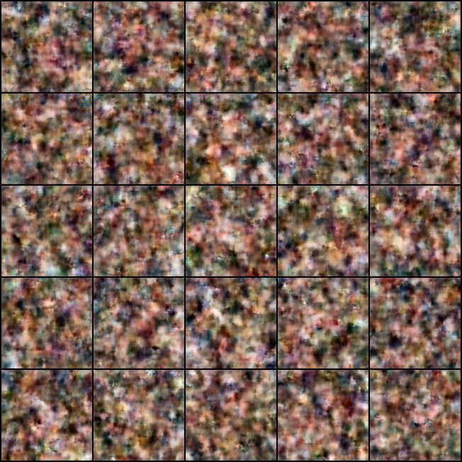
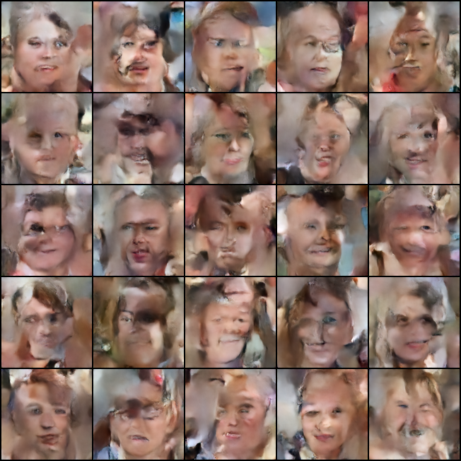
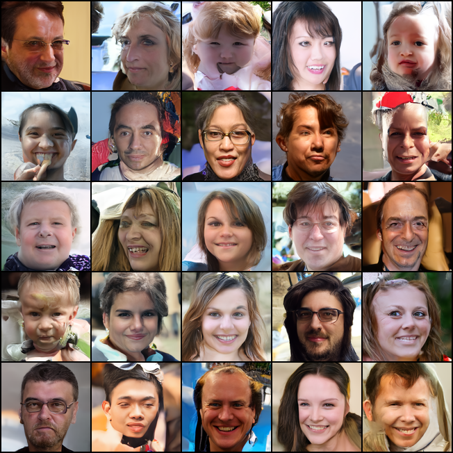
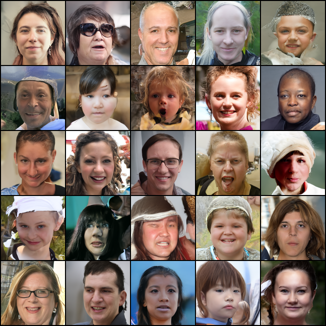
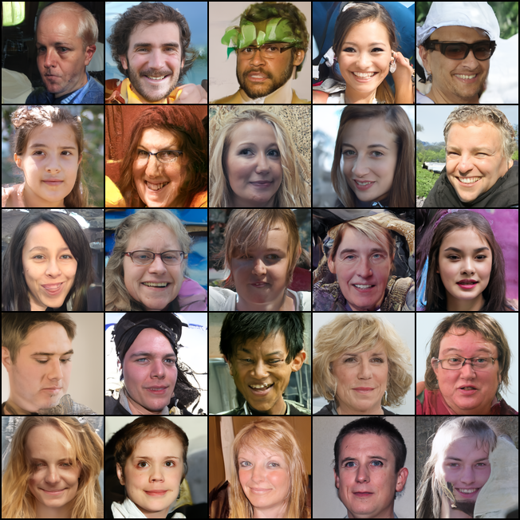

## Denoising Diffusion Probabilistic Model, in Pytorch

Implementation of <a href="https://arxiv.org/abs/2006.11239">Denoising Diffusion Probabilistic Model</a> in Pytorch. It is a new approach to generative modeling that may <a href="https://ajolicoeur.wordpress.com/the-new-contender-to-gans-score-matching-with-langevin-sampling/">have the potential</a> to rival GANs. It uses denoising score matching to estimate the gradient of the data distribution, followed by Langevin sampling to sample from the true distribution.

[](https://badge.fury.io/py/denoising-diffusion-pytorch)

## Install

```bash
$ pip install denoising_diffusion_pytorch
```

## Usage(FFHQ dataset) 

dataset source: https://github.com/NVlabs/ffhq-dataset  


### Training  
```python
import torch
from denoising_diffusion_pytorch import Unet, GaussianDiffusion, Trainer
from PIL import Image

if __name__ == '__main__':
    model = Unet(
        dim=64,
        dim_mults=(1, 2, 4, 8),
        channels=3
    ).cuda()

    diffusion = GaussianDiffusion(
        model,
        image_size=128,
        timesteps=1000,
        sampling_timesteps=250,
    ).cuda()

    trainer = Trainer(
        diffusion,
        r'dataset',                             # dataset path
        train_batch_size=16,
        train_lr=8e-5,
        save_and_sample_every=1000,
        train_num_steps=700000,
        gradient_accumulate_every=1,
        calculate_fid=False,
        ema_decay=0.995,
        amp=True
    )

    if torch.cuda.is_available():
        torch.multiprocessing.freeze_support()

    trainer.train()
    

```

Samples and model checkpoints will be logged to `./results` periodically


### test  

```python= 
import torch
from denoising_diffusion_pytorch import Unet, GaussianDiffusion, Trainer
from PIL import Image
import os

model = Unet(
	dim=64,
	dim_mults=(1, 2, 4, 8),
	channels=3
).cuda()

diffusion = GaussianDiffusion(
	model,
	image_size=128,
	timesteps=1000,
	sampling_timesteps=250,
).cuda()

trainer = Trainer(
	diffusion,
	r'dataset',
	train_batch_size=16,
	train_lr=8e-5,
	save_and_sample_every=1000,
	train_num_steps=700000,
	gradient_accumulate_every=1,
	calculate_fid=False,
	ema_decay=0.995,
	amp=True
)

trainer.load(100) # load model-100.pt # load the checkpoint

sampled_images = diffusion.sample(batch_size=8)

samples_root = r"./samples"
os.makedirs(samples_root , exist_ok=True)
len_samples = len(os.listdir(samples_root))

for i in range(sampled_images.size(0)):

	current_image_tensor = sampled_images [i]
	current_image = Image.fromarray((current_image_tensor.cpu().permute(1, 2, 0).numpy() * 255).astype('uint8'))
	file_name = f"output__image_{i + len_samples}.png"
	current_image.save(os.path.join(os.getcwd(),"samples/" + file_name))

print("all samples are save in folder")
```


## Result  

Platform: RTX A4500  
Training time: 52hr

|Iter 1 |Iter 5|Iter 10
|-|-|-
||


|Iter 10 |Iter 50|Iter 100
|-|-|-
||

|Iter 100 |Iter 500|Iter 700
|-|-|-
||

GPU memory 
|amp |no amp
|-|-
|7486MB |9130MB

return_all_timesteps
|step 0 |step 50 |step 100 |step 150 |step 200 |step 250 
|-|-|-|-|-|-
| |||||